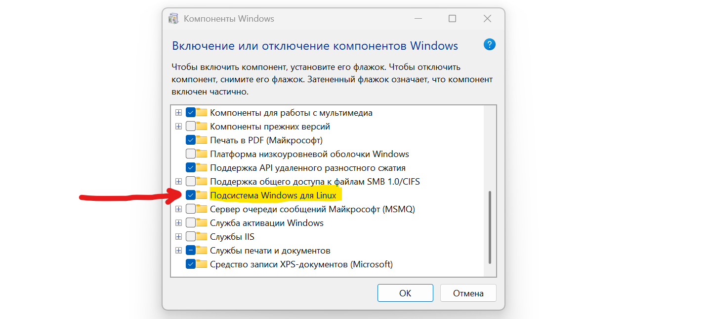
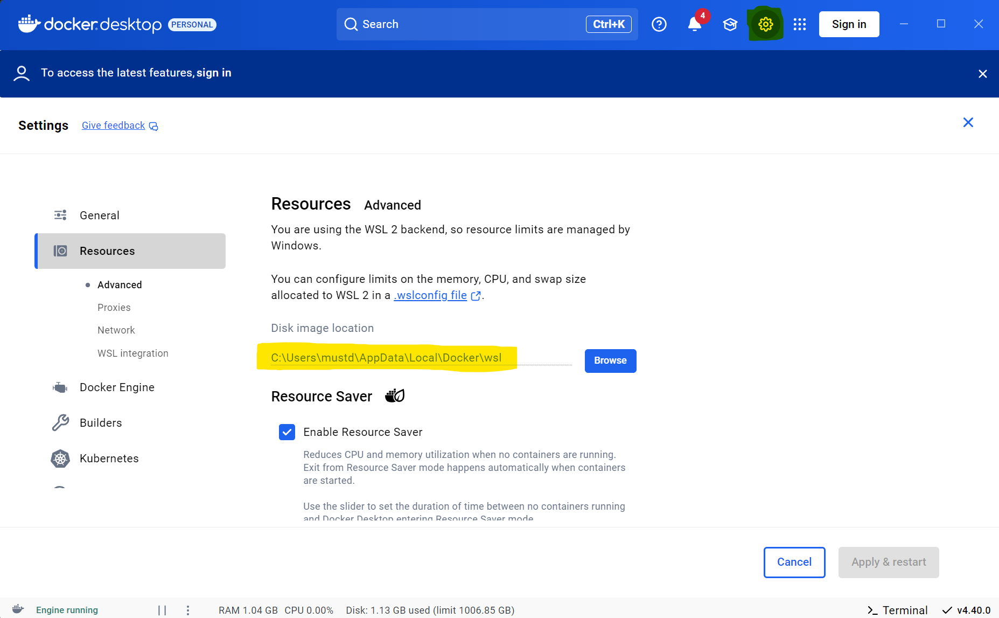
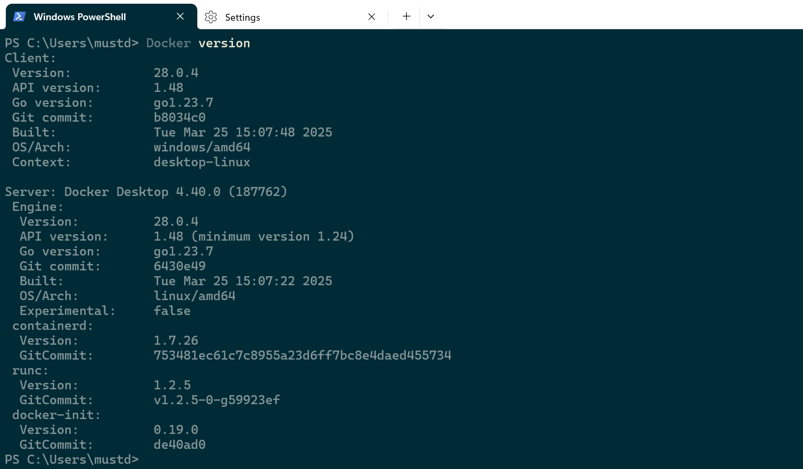

# 1 Установка Docker

Docker работает на ядре Linux. Чтобы она запустился на Windows, должен быть установлен WSL.

**Првоерить установлен ли WSL на ПК:**
1. Открыть `PowerShell`
2. Ввести команду:

```powershell
wsl -v
```


**Установка WSL**

```powershell
wsl --install
```


**Обновление WSL**

```powershell
wsl --update
```


После того как все установится, надо зайти в панель инструментов и ввести в поиске: `Включение или отключение компонентов Windows`


И в открывшимся окне, надо убедиться что стоит галочка напротив пункта: `Подсистема Windows для Linux`



Скачать последнюю версию Docker с родного сайта. Нужна версия для WSL.

https://www.docker.com/products/docker-desktop/

В BIOS включить пункт `Enable hardware virtualization`


После чего установить докер

Установить место хранения контейнеров



Проверяем что докер работает.

Открываем `PowerShell` и выполняем команду

```powershell
PS C:\Users\mustd> docker
Usage:  docker [OPTIONS] COMMAND

A self-sufficient runtime for containers

Common Commands:
  run         Create and run a new container from an image
  exec        Execute a command in a running container
  ps          List containers
  build       Build an image from a Dockerfile
  pull        Download an image from a registry
  push        Upload an image to a registry
  images      List images
  login       Authenticate to a registry
  logout      Log out from a registry
  search      Search Docker Hub for images
  version     Show the Docker version information
  info        Display system-wide information

Global Options:
      --config string      Location of client config files (default
                           "C:\\Users\\mustd\\.docker")
  -c, --context string     Name of the context to use to connect to the
                           daemon (overrides DOCKER_HOST env var and
                           default context set with "docker context use")
  -D, --debug              Enable debug mode
  -H, --host list          Daemon socket to connect to
  -l, --log-level string   Set the logging level ("debug", "info",
                           "warn", "error", "fatal") (default "info")
      --tls                Use TLS; implied by --tlsverify
      --tlscacert string   Trust certs signed only by this CA (default
                           "C:\\Users\\mustd\\.docker\\ca.pem")
      --tlscert string     Path to TLS certificate file (default
                           "C:\\Users\\mustd\\.docker\\cert.pem")
      --tlskey string      Path to TLS key file (default
                           "C:\\Users\\mustd\\.docker\\key.pem")
      --tlsverify          Use TLS and verify the remote
  -v, --version            Print version information and quit

Run 'docker COMMAND --help' for more information on a command.

For more help on how to use Docker, head to https://docs.docker.com/go/guides/
PS C:\Users\mustd>
```

```powershell
docker version
```

