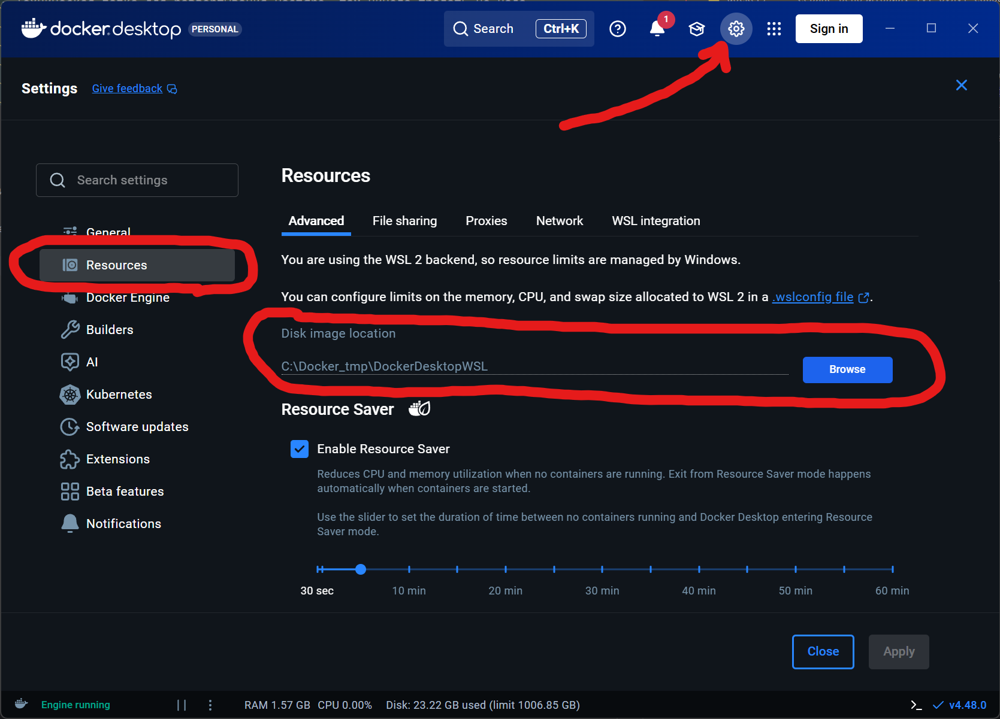
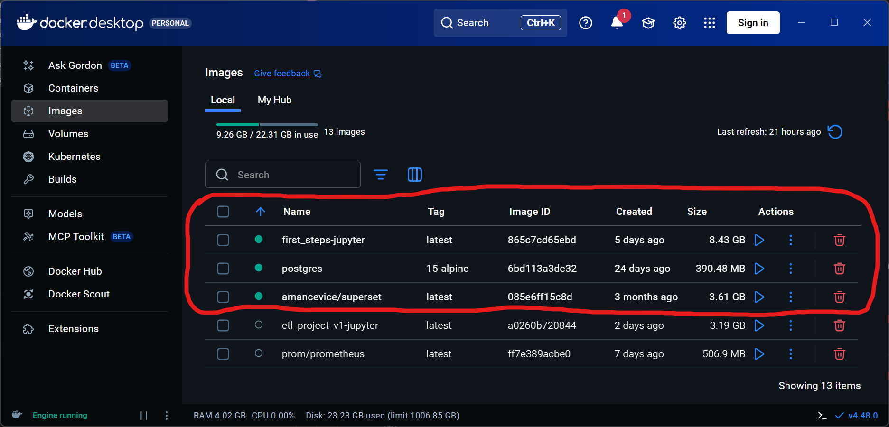
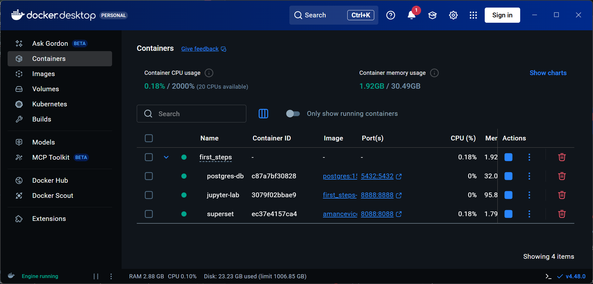
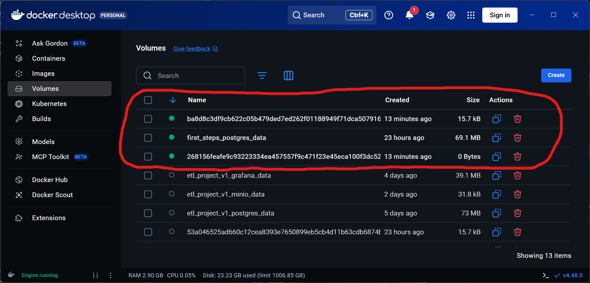

# Знакомство с инфраструктурой

## 1. Структура папок репозитория

```python
📁kakoy_kaif/
├── 📁 data/     - Тут лежат скриншоты и прочие вспомогательные файлы для красивого оформления ридмишек
├── 📁 docker/   - Сердце репозитория, тут будут собраны проекты на Docker Compose 
│   └── 📁 first_steps/           - Твой первый стенд
│       ├── 📁 jupyter/           - Рабочая папка для Jupyter, одновременно видна и в контейнере и на машине
│       ├── 📁 postgres/          - Техническая папка для развертывания Postgre, там ничего трогать не надо
│       ├── 📁 superset/          - Тут хранится бд для Superset, дашборды и тп
│       ├── 🐳 Dockerfile.jupyter - Файл отвечает за формирование контейнера с Jupyter
│       └── 🐳 compose.yml        - Сердце стенда, в нем описана логика сборки образов и контейнеров
├── 🔒 .gitignore       - В этом файле указан мусор, который не надо синхронить с гитом
├── 📄 readme.md        - readme.md в корне папки автоматом наглядно выводится на сайте GitHub
├── 📄 task_01_start.md - твои задания в разметке markdown
├── 📄 task_02_start.md
└── 📄 task_03_start.md
```

# 2. Docker

Главный инструмент по виртуализации твоих сервисов.

Для начала давай настроим временные папки, а потом посмотрим как все устроено.

## Папка хранения образов



- Зайди в настройки и измени временную папку.
- Оставь ее где-нибудь на виду, время от времени ее придется чистить, так как она растет как на дрожжах

Теперь познакомимся с интерфейсом. 

Такой вид он примет **после** запуска `Docker Compose`

## Образы (Images)



- После первого запуска Docker Compose тут будут созданы образы сервисов. Там будет лежать вся необходимая структура и информация для запуска контейнеров.
- Важный момент, образ скачивается один раз и не удаляется после остановки сервисов. В отличии, от контейнеров.
- Если удалить образ руками, ничего страшного не случится, просто при следующем запуске Docker Compose, он заново будет выкачан и создан.
- Готовые скачанные образы как раз нужны для того чтобы сервис стартовал мгновенно.

## Контейнеры (Containers)



- Внешне очень похожи на образы, но в отличии, от них, контейнеры создаются только на время сессии, и после остановки автоматически удаляются.
- Во время сессии полностью висят в оперативной памяти, нещадно ее потребляя. 
- По сути в контейнерах и происходит вся виртуализация в реальном времени.

## Тома (Volumes)



- Тома (они же волюмы) Это постоянная память для твоих сервисов. 
- Волюмы не удаляются после остановки сервисов и даже после удаления образов.
- Например, на скриншоте видно волюм `first_steps_postgres_data` это хранилище для базы данных `Postgres`, там будут оседать все таблицы которые ты будешь создавать в `DBeaver` и тп.
- Волюм можно удалить руками, после остановки сервисов, но надо понимать что вместе с ним удалится вся накопленная информация
- Для Волюмов есть альтернатива, можно привязать локальную папку на диске компьютера, чтобы вся информация сливалась туда
- Когда-то удобней делать волюм (как в примере с Postgres)
- Когда-то локальные папки (Так сделано для тетрадок Jupyter например, и бд Superset, потому что там всего 1 файл)
- Волюмы с абракадаброй вместо имени, это вспомогательные хранилища технической информации, они создаются автоматически для контейнеров. После остановки сервисов их можно удалять, там ничего важного нет.

На этом пока все. В следующем задании развернем сервис.